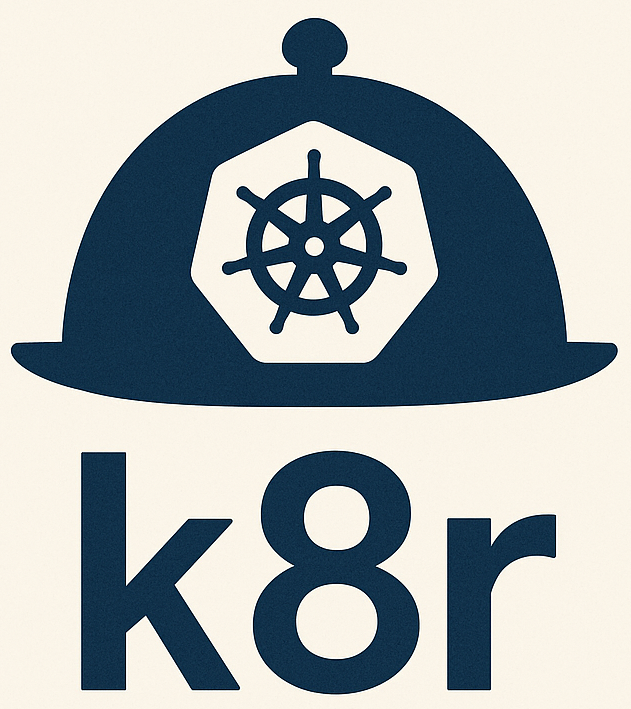
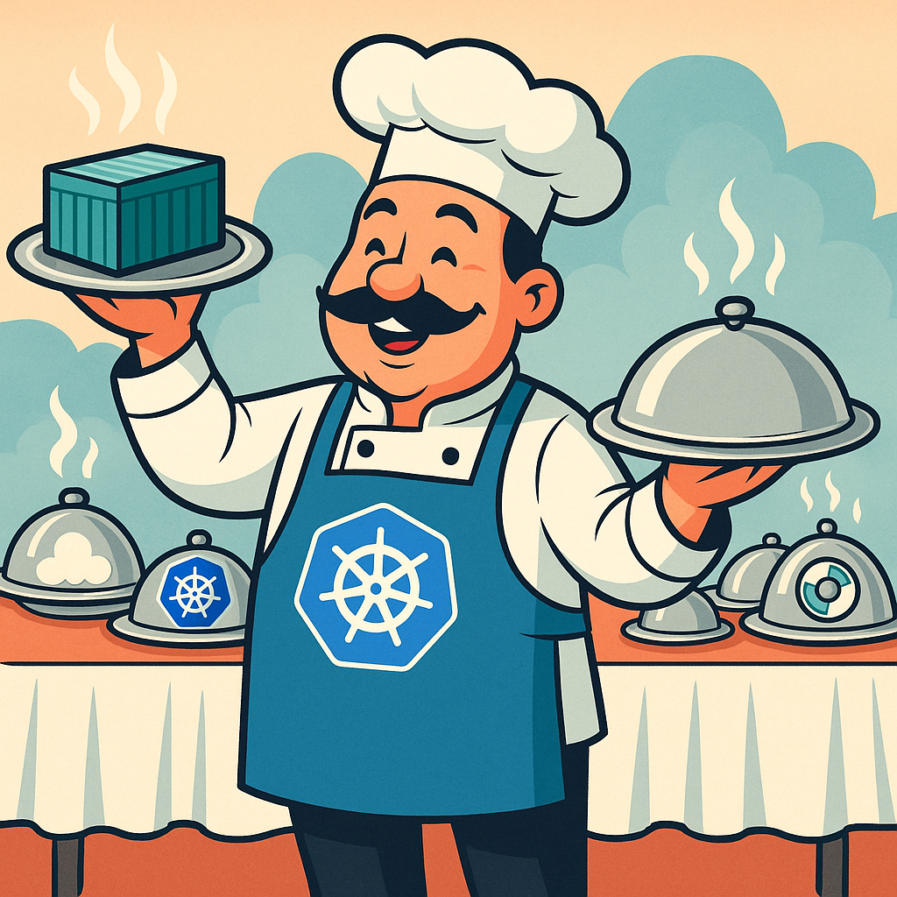

#  k8s-run (k8r)

<div align="center">
  
  <br>
  <em>A minimal tool to easily run Kubernetes Jobs from local directories, GitHub repositories, Dockerfiles, or container images.</em>
  <br><br>
  
  [](https://kubernetes.io/)
  [](https://python.org/)
  [](https://github.com/astral-sh/uv)
</div>

## 🚀 Overview

k8s-run (shortened to `k8r`) simplifies running workloads in Kubernetes by automatically creating Jobs from various sources:

| Source Type | Description | Use Case |
|-------------|-------------|----------|
| 📁 **Local directories** | Files packaged into ConfigMaps | Quick scripts, data processing |
| 🐙 **GitHub repositories** | Code cloned directly in container | CI/CD, testing, deployment |
| 🐳 **Dockerfiles** | Images built and pushed to registry | Custom environments, complex apps |
| 📦 **Container images** | Run existing images directly | Redis, databases, pre-built tools |

## ✨ Key Features

- 🔄 **Parallel execution** - Run multiple job instances simultaneously
- ⏱️ **Timeout control** - Configurable job timeouts with sensible defaults
- 🏷️ **Smart labeling** - Isolates k8r jobs from other cluster workloads
- 🔍 **Easy monitoring** - Built-in job status tracking and log viewing
- 🛡️ **Safety first** - Only manages jobs it created, prevents accidents
- 🎯 **Namespace aware** - Automatically detects your current kubectl context

## 📦 Installation

### Prerequisites

- ✅ Python 3.8+
- ✅ Kubernetes cluster access (kubectl configured)
- ✅ Docker (for Dockerfile mode)
- ✅ [uv package manager](https://github.com/astral-sh/uv)

### ⚡ Quick Install (Recommended)

```bash
curl -fsSL https://raw.githubusercontent.com/jeremyplichta/k8s-run/main/install.sh | bash
```

This will:
- 📥 Download k8r to `~/.local/bin/k8r/`
- 🔧 Set up dependencies automatically  
- 🔗 Add shell integration to your profile
- ✅ Make `k8r` available globally

### 🔄 Update k8r

```bash
# Use the built-in update command (recommended)
k8r update

# Or re-run the installer to update to the latest version
curl -fsSL https://raw.githubusercontent.com/jeremyplichta/k8s-run/main/install.sh | bash
```

### 🔧 Manual Install

```bash
git clone https://github.com/jeremyplichta/k8s-run.git
cd k8s-run
uv sync  # Optional - the shell function will do this automatically
```

### 🔗 Shell Integration (Manual Install Only)

If you installed manually, add the shell function to your profile:

```bash
# Run from the k8s-run directory
python k8r.py env >> ~/.zshrc  # or ~/.bashrc
source ~/.zshrc

# Now you can use k8r from anywhere! 🎉
k8r --help
```

> 💡 **Note**: The quick install script handles this automatically!

<details>
<summary>🔍 What the shell function does</summary>

The shell function automatically:
- ✨ Creates a virtual environment (`.venv`) in the k8r directory if it doesn't exist
- 📦 Installs dependencies using `uv sync` on first run
- 🔄 Activates the virtual environment and runs the command
- 📍 Keeps you in your current working directory

</details>

## 🚀 Quick Start

### 📁 Run a local directory

```bash
# Run a Python script from current directory with 8 parallel jobs
k8r ./ --num 8 -- python run_script.py --arg1 value1

# Use a specific timeout
k8r ./ --timeout 30m -- ./my_script.sh

# Create as deployment instead of job
k8r ./ --as-deployment --num 3 -- python web_server.py

# Preview YAML without applying
k8r ./ --show-yaml -- python process.py

# Delete existing job if it exists and create new one
k8r ./ --rm -- python process.py
```

### 🐙 Run from GitHub

```bash
# Clone and run from GitHub repository
k8r git@github.com:user/repo.git --num 2 -- python main.py

# Using HTTPS URL
k8r https://github.com/user/repo.git -- make test
```

### 🐳 Run from Dockerfile

```bash
# Build image and run
k8r Dockerfile -- python app.py

# Use custom Dockerfile
k8r path/to/Custom.dockerfile -- ./entrypoint.sh
```

### 📦 Run container image

```bash
# Run existing container
k8r redis:7.0 -- redis-server --port 6380

# Run with custom command
k8r ubuntu:22.04 -- bash -c "apt update && apt install -y curl"
```

### 🔐 Managing Secrets

```bash
# Create secret from string
k8r secret api-key "my-secret-value"

# Create secret from file
k8r secret database-cert ./db.crt

# Create secret from directory (all files)
k8r secret app-config ./config/

# Preview secret YAML
k8r secret my-secret "value" --show-yaml

# Associate secret with specific job
k8r secret api-key "value" --job-name my-custom-job

# Share secrets between jobs
k8r ./new-job --secret-job existing-job -- python script.py
```

### 🌐 Namespace Management

```bash
# Run in specific namespace
k8r --namespace production ./ -- python app.py

# List jobs in specific namespace
k8r --namespace staging ls

# All commands support namespace override
k8r --namespace dev secret api-key "value"
```

> 💡 **Pro Tip**: Without shell integration, run from the k8s-run directory:  
> `cd /path/to/k8s-run && uv run python k8r.py ./ --num 8 -- python run_script.py`

## 📖 Command Reference

### 🎯 Main Commands

k8r uses subcommands to organize functionality. The `run` command is used by default when no subcommand is specified.

```bash
k8r [GLOBAL_OPTIONS] COMMAND [COMMAND_OPTIONS] -- [ARGS...]
```

#### Global Options

| Option | Description | Example |
|--------|-------------|---------|
| `--namespace NAMESPACE` | Kubernetes namespace (overrides kubeconfig context) | `--namespace my-ns` |

### 🚀 Run Command (Default)

Create and run Kubernetes Jobs or Deployments.

```bash
k8r [run] SOURCE [OPTIONS] -- COMMAND [ARGS...]
```

> ⚠️ **Job Name Behavior**: k8r will now error if a job with the same name already exists, instead of auto-incrementing the name. Use `--rm` to delete the existing job first, or use a different `--job-name`.

| Option | Description | Default | Example |
|--------|-------------|---------|---------|
| `--num N` | Number of parallel job instances | `1` | `--num 8` |
| `--timeout DURATION` | Job timeout (1h, 30m, 3600s) | `1h` | `--timeout 30m` |
| `--base-image IMAGE` | Base container for directory/GitHub mode | `alpine:latest` | `--base-image python:3.9` |
| `--job-name NAME` | Custom job name | auto-generated | `--job-name my-job` |
| `-d, --detach` | Run in background without monitoring | disabled | `-d` |
| `-f, --follow` | Follow logs after job starts | disabled | `-f` |
| `--show-yaml` | Print YAML to stdout instead of applying | disabled | `--show-yaml` |
| `--as-deployment` | Create as Deployment instead of Job | disabled | `--as-deployment` |
| `--retry N` | Set restart policy to OnFailure with backoff limit N | Never restart | `--retry 3` |
| `--rm` | Delete existing job with same name before creating new one | disabled | `--rm` |
| `--mem MEMORY` | Memory request/limit (single value or range) | none | `--mem 8gb`, `--mem 2gb-8gb` |
| `--cpu CPU` | CPU request/limit (single value or range) | none | `--cpu 1000m`, `--cpu 0.5-2` |
| `--secret-job JOB_NAME` | Use secrets from a different job name | current job | `--secret-job existing-job` |

### 🛠️ Management Commands

| Command | Description | Example |
|---------|-------------|---------|
| `k8r ls` | 📋 List all k8r jobs | `k8r ls` |
| `k8r logs <job-name>` | 📄 View job logs | `k8r logs my-job` |
| `k8r logs <job-name> -f` | 📺 Follow logs in real-time | `k8r logs my-job -f` |
| `k8r rm <job-name>` | 🗑️ Delete a job (preserves secrets) | `k8r rm my-job` |
| `k8r rm <job-name> --rm-secrets` | 🗑️ Delete job and associated secrets | `k8r rm my-job --rm-secrets` |
| `k8r rm <job-name> -f` | ⚠️ Force delete (even with running pods) | `k8r rm my-job -f` |

### 🔐 Secret Management

| Command | Description | Example |
|---------|-------------|---------|
| `k8r secret <name> <value>` | 🔒 Create secret from string/file/directory | `k8r secret api-key "secret123"` |
| `k8r secret <name> <file>` | 📄 Create secret from file | `k8r secret cert ./tls.crt` |
| `k8r secret <name> <dir>` | 📁 Create secret from directory | `k8r secret config ./config/` |

Secret command options:
- `--job-name NAME`: Override job name for secret association
- `--show-yaml`: Print YAML to stdout instead of applying

### 🔧 Utility Commands

| Command | Description | Example |
|---------|-------------|---------|
| `k8r update` | 🔄 Update k8r to latest main branch | `k8r update` |
| `k8r update <branch>` | 🔄 Update k8r to specific branch | `k8r update develop` |
| `k8r env` | 🔧 Print shell integration code | `k8r env` |

### 🔄 Self-Updating

```bash
# Update to latest main branch
k8r update

# Switch to and update a different branch
k8r update develop

# Example output:
# 🔄 Updating k8r to latest 'main' branch...
# 📥 Fetching latest changes...
# ⬇️ Pulling latest changes from 'main'...
# 📦 Updating dependencies...
# ✅ Updated to a1b2c3d - Add new feature (2025-07-12)
```

### 📊 Example Output

```bash
$ k8r ls
Job Name     | Type       | Desired | Running | Complete | Failed
=================================================================
data-proc    | directory  | 8       | 2       | 6        | 0     
redis-test   | container  | 1       | 0       | 1        | 0
```

## ⚙️ Advanced Usage

### 🔁 Job Restart Policies

k8r jobs use different restart policies depending on the `--retry` flag:

| Configuration | Restart Policy | Behavior | Use Case |
|---------------|----------------|----------|----------|
| Default (no `--retry`) | `Never` | Job pods don't restart on failure | One-shot tasks, data processing |
| `--retry N` | `OnFailure` | Job retries failed pods up to N times | Tasks that may fail temporarily |

**Examples:**
```bash
# Default: Never restart on failure
k8r ./ -- python critical_task.py

# Retry up to 3 times on failure
k8r ./ --retry 3 -- python flaky_network_task.py

# Retry up to 5 times for unreliable operations
k8r ./ --retry 5 -- curl https://unreliable-api.com/data
```

### 🌍 Environment Variables

| Variable | Description | Default |
|----------|-------------|---------|
| `K8R_NAMESPACE` | Kubernetes namespace | *auto-detected from kubeconfig* |
| `K8R_REGISTRY` | Docker registry for Dockerfile mode | `gcr.io` |
| `K8R_PROJECT` | Registry project for Dockerfile mode | `default-project` |
| `K8R_ORIGINAL_PWD` | Original working directory (set by shell function) | *auto-set* |

### 🆕 New Features

- **🔄 Subcommand Organization**: Clear command structure with `run`, `ls`, `logs`, `rm`, `secret`, and `env`
- **🎯 Default Run Command**: Use `k8r ./ -- command` or `k8r run ./ -- command` interchangeably
- **📋 YAML Preview**: Use `--show-yaml` to see generated Kubernetes YAML before applying
- **🚀 Deployment Mode**: Use `--as-deployment` to create long-running Deployments instead of Jobs
- **🌐 Namespace Support**: Global `--namespace` option works with all commands
- **🔐 Enhanced Secrets**: `k8r secret` command supports `--job-name` and `--show-yaml` options
- **🔗 Secret Sharing**: Use `--secret-job` to mount secrets from other jobs without duplication
- **📍 Context Preservation**: Shell function now preserves original working directory for accurate job naming
- **🔄 Self-Updating**: `k8r update` command for easy updates with branch switching support
- **📊 Resource Management**: Use `--mem` and `--cpu` flags to specify resource requests and limits

### 🔗 Secret Sharing Between Jobs

The `--secret-job` option allows you to mount secrets from one job into another, enabling secret sharing without duplication:

```bash
# Create secrets for a base job
k8r secret database-url "postgres://user:pass@db:5432/app" --job-name base-job
k8r secret api-key "secret-api-key-123" --job-name base-job

# Create new jobs that use the same secrets
k8r ./worker-1 --secret-job base-job -- python worker.py
k8r ./worker-2 --secret-job base-job -- python different_worker.py

# Works with deployments too
k8r ./api-server --secret-job base-job --as-deployment -- python server.py

# You can still specify your own job name while using another job's secrets
k8r ./new-service --job-name my-service --secret-job base-job -- python service.py
```

This feature is particularly useful for:
- **Microservices** that need shared database credentials or API keys
- **CI/CD pipelines** where multiple jobs need the same secrets
- **Multi-environment deployments** where secrets are managed centrally
- **Blue-green deployments** where new versions need existing secrets

### 📊 Resource Management

k8r supports specifying CPU and memory resources for your jobs:

```bash
# Single value sets both requests and limits
k8r ./ --mem 8gb --cpu 1000m -- python heavy_task.py

# Range format: requests-limits
k8r ./ --mem 2gb-8gb --cpu 500m-2000m -- python scaling_task.py

# CPU can use millicores (1000m = 1 CPU) or decimal (0.5 = 500m)
k8r ./ --cpu 0.5 -- python light_task.py
k8r ./ --cpu 0.5-2 -- python burst_task.py

# Memory supports standard units
k8r ./ --mem 512mi --cpu 250m -- python memory_task.py
k8r ./ --mem 4gi -- python large_memory_task.py
```

**Resource Formats:**
- **Memory**: `8gb`, `4gi`, `512mi`, `1024mb`, `2gb-8gb`
- **CPU**: `1000m`, `1`, `0.5`, `500m-2000m`, `0.5-2`

### 🚀 Startup Scripts

For directory and GitHub modes, if a `k8s-startup.sh` file exists, it will be executed before your command:

```bash
#!/bin/bash
# k8s-startup.sh - Automatic setup script
apt-get update
apt-get install -y python3-pip
pip3 install -r requirements.txt
```

### 🐳 Custom Base Images

```bash
# Python projects
k8r ./ --base-image python:3.9 -- python app.py

# Node.js projects  
k8r ./ --base-image node:16 -- npm start

# GPU workloads
k8r ./ --base-image tensorflow/tensorflow:latest-gpu -- python train.py
```

### 📦 Registry Configuration

```bash
export K8R_REGISTRY=your-registry.com
export K8R_PROJECT=your-project
k8r Dockerfile -- python app.py
```

## 💡 Real-World Examples

### 📊 Data Processing Pipeline

```bash
# Process large datasets with 10 parallel workers
k8r ./data-processor --num 10 --timeout 2h -- \
  python process.py --input /data --batch-size 1000
```

### 🧪 Distributed Testing

```bash
# Run comprehensive test suite across multiple pods
k8r https://github.com/jeremyplichta/k8s-run.git --num 4 -- \
  pytest tests/ -v --parallel
```

### 🤖 Machine Learning Training

```bash
# Train ML model with GPU acceleration and high memory
k8r ./ml-training --base-image tensorflow/tensorflow:latest-gpu \
  --mem 16gb --cpu 4 -- \
  python train.py --epochs 100 --learning-rate 0.001
```

### ⚡ High-Throughput Batch Processing

```bash
# Process job queue with 20 workers and resource limits
k8r ./batch-processor --num 20 --timeout 4h \
  --mem 4gb-8gb --cpu 500m-2000m -- \
  python worker.py --queue redis://redis:6379 --batch-size 50
```

### 🔄 ETL Pipeline

```bash
# Extract, transform, load data pipeline
k8r git@github.com:company/etl-pipeline.git --num 5 -- \
  python etl.py --source postgres://db:5432 --target s3://bucket/data
```

## 🔧 How It Works

<div align="center">
  
</div>

### 📁 Directory Mode
1. 🗜️ **Archive**: Creates tar.gz of your directory
2. 🗂️ **ConfigMap**: Stores archive in Kubernetes ConfigMap  
3. 🔗 **Mount**: Mounts ConfigMap in container at `/configmap`
4. 📦 **Extract**: Unpacks files to `/workspace`
5. 🏃 **Execute**: Runs your command in the workspace

### 🐙 GitHub Mode  
1. 📥 **Clone**: Uses `git clone` in the container
2. 🚀 **Setup**: Runs optional `k8s-startup.sh` 
3. 🎯 **Execute**: Runs your command in cloned directory

### 🐳 Dockerfile Mode
1. 🔨 **Build**: Builds Docker image from Dockerfile
2. 📤 **Push**: Pushes to configured registry
3. 🎯 **Deploy**: Creates Job using built image

### 📦 Container Mode
1. 🚀 **Direct**: Uses specified container image directly
2. 🎯 **Execute**: Runs your command or image's entrypoint

---

## 🛠️ Troubleshooting

### ❓ Common Issues

| Problem | Solution |
|---------|----------|
| 🚫 "Could not load Kubernetes configuration" | • Ensure kubectl is configured: `kubectl cluster-info`<br>• Check kubeconfig: `echo $KUBECONFIG` |
| 🐳 "Permission denied" for Docker | • Ensure Docker daemon is running<br>• Add user to docker group: `sudo usermod -aG docker $USER` |
| ⚠️ Job fails immediately | • Check logs: `k8r logs <job-name>`<br>• Verify base image has required tools<br>• Check k8s-startup.sh for errors |
| 📦 ConfigMap too large | • Directory mode has size limits (~1MB)<br>• Use .gitignore patterns to exclude large files<br>• Consider using GitHub mode instead |

### 🔍 Debug Mode

```bash
export KUBERNETES_DEBUG=1
k8r ./my-project -- python debug.py
```

---

## 🤝 Contributing

We welcome contributions! Here's how to get started:

1. 🍴 Fork the repository
2. 🌿 Create a feature branch: `git checkout -b feature/amazing-feature`
3. ✨ Make your changes
4. 🧪 Run tests: `pytest`
5. 📝 Submit a pull request

## 📄 License

MIT License - see [LICENSE](LICENSE) file for details.

---

<div align="center">
  
  <br>
  <strong>k8s-run (k8r)</strong> - Making Kubernetes Jobs simple and fun!
  <br><br>
  
  ⭐ **Star this repo if you find it useful!** ⭐
  
  <br>
  
  Made with ❤️ for the Kubernetes community
</div>